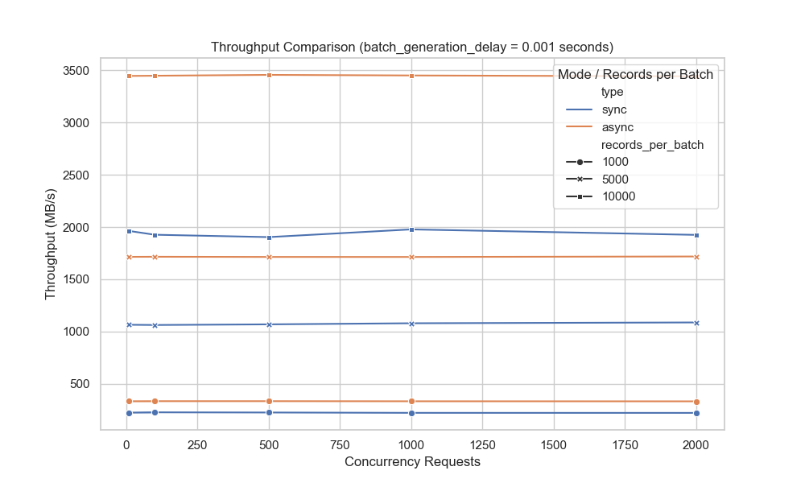
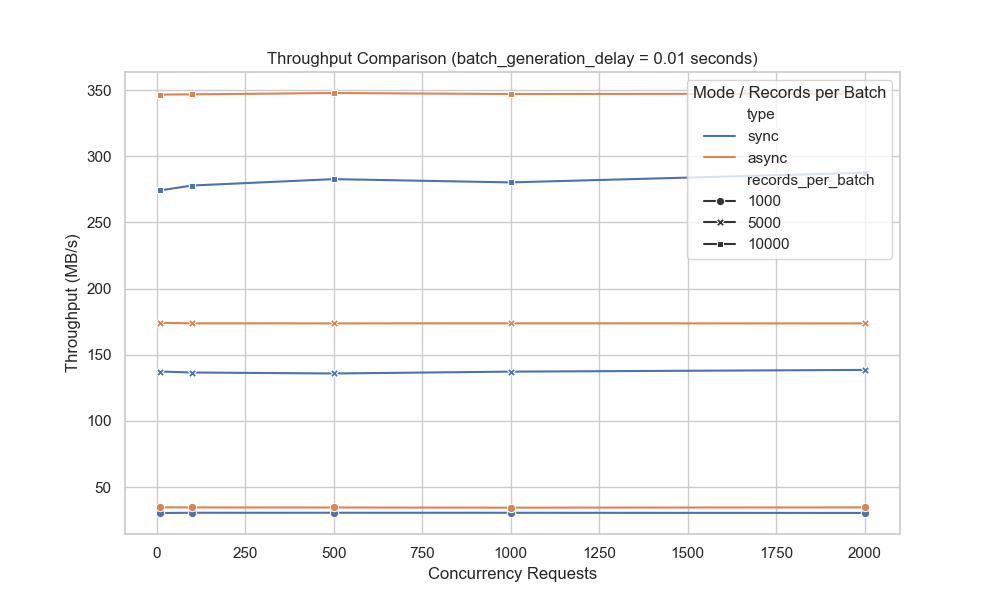
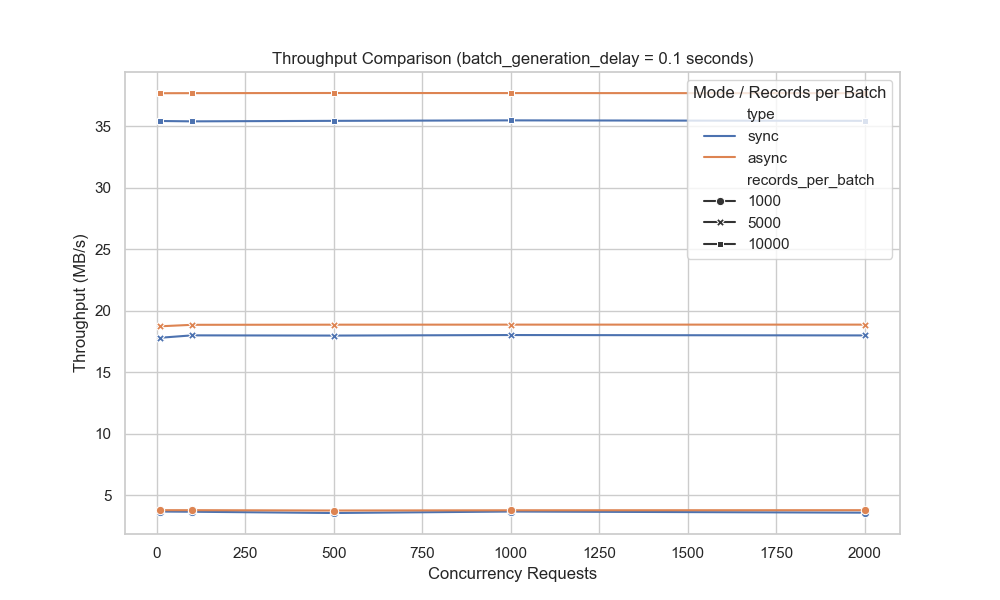

# **Benchmark Analysis: Synchronous vs. Asynchronous Batch Generation**

This document provides an in-depth analysis of the benchmark results comparing the synchronous (`sync`) and
asynchronous (`async`) versions of the `generate_batches` method. The benchmark aims to evaluate the performance under
different conditions, such as `records_per_batch`, `concurrent_requests`, and `batch_generation_delay`, to determine the
optimal method for various scenarios.

---

### **Key Metrics and Parameters**

Before diving into the detailed analysis, here’s a breakdown of the key parameters used in the benchmark:

1. **`records_per_batch`**: Represents the number of records in each batch. The benchmark tests were performed with
   batch sizes of 1000, 5000, and 10,000.
2. **`concurrent_requests`**: This denotes the number of concurrent requests sent during the test. The benchmark used
   concurrency levels ranging from 10 to 2000.
3. **`batch_generation_delay`**: Simulates the time spent generating each record batch. The delay ranges from 0.001
   seconds (short) to 0.1 seconds (long) to mimic different I/O operation times.
4. **`average_latency`**: The average response time of each `do_get` request across all concurrent requests. This value
   represents the mean latency experienced when fetching batches during the test.
5. **`throughput_MBps`**: The average data throughput in megabytes per second (MB/s) across all concurrent requests,
   representing the total processing capacity during the benchmark.

---

### **Testing Environment**

The benchmark was conducted on the following hardware:

- **Device**: MacBook Pro
- **Processor**: M2 Max CPU
- **Memory**: 32GB RAM

This machine provides robust multi-core processing power and ample memory to handle high concurrency and large batch
sizes, making the results from this setup highly indicative of performance trends in modern computing environments.

---

### **1. Short `batch_generation_delay` (0.001 seconds)**

For the shortest `batch_generation_delay` (0.001 seconds), the asynchronous version significantly outperforms the
synchronous version, particularly under high concurrency. The asynchronous model can efficiently leverage CPU resources
by handling multiple concurrent requests while waiting for I/O operations, leading to higher overall throughput:



- **Advantages of the Asynchronous Model**:
    - When concurrent requests are high (e.g., 1000 or 2000), the throughput of the asynchronous version is over 50%
      higher than that of the synchronous version, especially with larger batch sizes (e.g., `records_per_batch = 5000`
      or `records_per_batch = 10,000`). This is because the asynchronous model can handle other tasks while waiting for
      I/O, thus maximizing CPU utilization.
    - **Example Data**: With `records_per_batch = 10,000` and `concurrent_requests = 1000`, the asynchronous version’s
      average throughput is **3450 MB/s**, while the synchronous version only reaches **1977 MB/s**.

- **Disadvantages of the Synchronous Model**:
    - In the synchronous model, CPU resources are blocked during I/O operations, leading to lower overall throughput.
      This is particularly problematic in high-concurrency scenarios (e.g., 1000+ concurrent requests), where
      performance degrades significantly.

### **2. Medium `batch_generation_delay` (0.01 seconds)**

As the `batch_generation_delay` increases, the performance advantage of the asynchronous model starts to diminish. While
the asynchronous version still outperforms the synchronous version, the gap between the two narrows:



- **Asynchronous Model Still Leads**:
    - Even with a `batch_generation_delay` of 0.01 seconds, the asynchronous version continues to exhibit about 20-25%
      higher throughput in high-concurrency scenarios (e.g., `concurrent_requests = 1000` or 2000).
    - **Example Data**: With `records_per_batch = 5000` and `concurrent_requests = 1000`, the asynchronous version
      achieves an average throughput of **173.75 MB/s**, while the synchronous version manages **137.25 MB/s**.

- **Narrowing Performance Gap**:
    - As the delay increases, the time spent waiting on I/O operations grows, reducing the asynchronous model's ability
      to fully capitalize on non-blocking behavior. Consequently, the throughput advantage of the asynchronous version
      becomes less pronounced.

### **3. Long `batch_generation_delay` (0.1 seconds)**

When the `batch_generation_delay` is extended to 0.1 seconds, the performance gap between the asynchronous and
synchronous versions nearly disappears. Both models exhibit similar throughput, particularly in high-concurrency
scenarios.



- **Convergence of Asynchronous and Synchronous Performance**:
    - At longer I/O times, both models become limited by the duration of the I/O operations themselves. As a result, CPU
      utilization is no longer the bottleneck, and the throughput for both synchronous and asynchronous versions becomes
      similar.
    - **Example Data**: With `records_per_batch = 1000` and `concurrent_requests = 1000`, the asynchronous version’s
      average throughput is **3.77 MB/s**, while the synchronous version reaches **3.66 MB/s**. The difference is
      negligible.

### **Impact of Batch Size**

- **Smaller Batch Sizes (`records_per_batch = 1000`)**: In scenarios with smaller batch sizes, the asynchronous model
  performs significantly better when `batch_generation_delay` is short, but the performance gap diminishes quickly as
  the delay increases.
- **Larger Batch Sizes (`records_per_batch = 10,000`)**: With larger batch sizes, the asynchronous model shows
  substantial throughput gains, especially when `batch_generation_delay` is shorter (0.001 seconds) or moderate (0.01
  seconds). However, as the delay grows longer, the performance difference between asynchronous and synchronous models
  reduces.

### **Conclusion**

From the benchmark results, we can derive the following conclusions:

1. **The asynchronous version performs best when the I/O operation time is short**, particularly in high-concurrency,
   large-batch scenarios where it significantly increases throughput and reduces latency.
2. **As the I/O operation time increases, the asynchronous version’s advantage diminishes**, and both asynchronous and
   synchronous models exhibit similar performance when `batch_generation_delay` is long (e.g., 0.1 seconds).
3. **Scenario Selection**: The asynchronous model is optimal for high-concurrency, short-I/O scenarios, while in cases
   where I/O operations are slow, the performance difference between the two models becomes negligible, making either
   option viable.

This analysis provides insight into selecting the appropriate model for the `generate_batches` method based on your
application’s needs. For high-throughput applications with short I/O times, the asynchronous model is a clear winner,
while in slower I/O scenarios, the performance difference becomes less critical.

---

### **How to Run the Benchmark**

To reproduce the benchmark results, follow these steps using the provided scripts: `server_async.py`, `server_sync.py`,
`run_benchmark.py`, and `plot_benchmark_results.py`.

#### **Step 1: Install Dependencies**

Before running the benchmark, ensure that all required dependencies are installed. In the same folder where the
`pyproject.toml` file is located, run the following command to install the dependencies:

```bash
pip install -r pyproject.toml
```

This command installs all the necessary Python packages for running the benchmark.

#### **Step 2: Start the Flight Servers**

You need to start both the synchronous and asynchronous Flight servers in separate terminals.

1. **Start the synchronous server**:

```bash
python server_sync.py
```

This will launch a synchronous Arrow Flight server that handles `do_get` requests synchronously.

2. **Start the asynchronous server**:

```bash
python server_async.py
```

This will launch an asynchronous Arrow Flight server that handles `do_get` requests asynchronously.

Make sure both servers are running before proceeding with the benchmark.

#### **Step 3: Run the Benchmark to Generate `results.csv`**

Once the servers are running, execute the benchmark script to generate the performance data. This script will conduct
tests on both the synchronous and asynchronous servers, then save the results in a CSV file (`results.csv`).

```bash
python run_benchmark.py
```

This script runs the benchmark under various configurations, such as different `records_per_batch`,
`concurrent_requests`, and `batch_generation_delay`. The output is saved in `results.csv`, which includes key
performance metrics like latency and throughput.

#### **Step 4: Generate Benchmark Plots**

After running the benchmark and generating the `results.csv` file, use the plotting script to generate visual
representations of the data. This script will create plots to compare the performance of the synchronous and
asynchronous servers.

```bash
python plot_benchmark_results.py
```

This script reads the `results.csv` file, processes the data, and generates plots comparing the throughput and latency
of both the synchronous and asynchronous implementations under various conditions. The plots are saved as image files (
`throughput_1ms.png`, `throughput_10ms.png`, and `throughput_100ms.png`).
