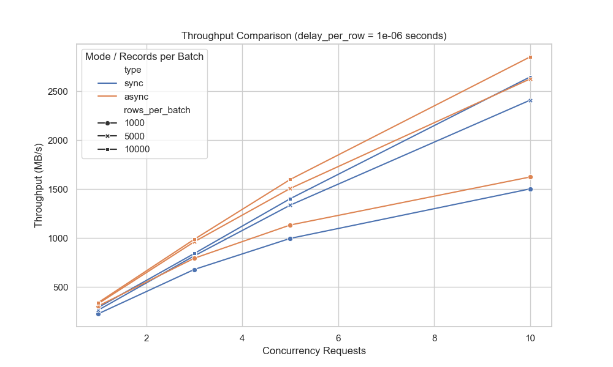
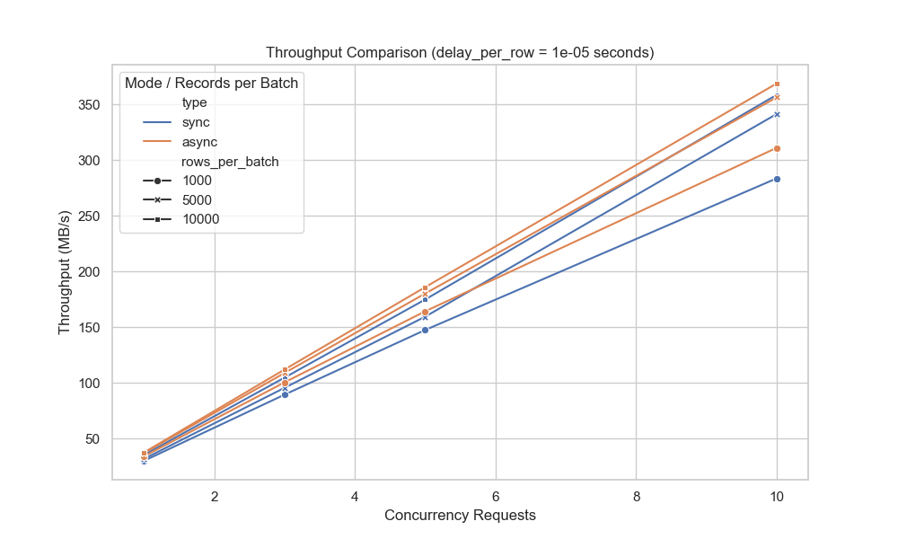

# FastFlight Benchmark Analysis

This folder contains benchmark scripts to compare the performance of FastFlight's synchronous (sync) and asynchronous (
async) batch data transmission implementations. The tests focus on the following two key metrics:

- **Average Latency (average_latency):** The response time per request (in seconds).
- **Throughput (throughput_MBps):** The data transfer efficiency (in MB/s).

The tests evaluate the impact of the following parameters:

- **Rows per Batch (rows_per_batch):** 1k, 5k, and 10k , which determine the data volume per transfer.
- **Concurrent Requests (concurrent_requests):** Varying from low to high concurrency.
- **Delay per Row (delay_per_row):** Two settings are used:
    - **Low Delay:** 1µs per row
    - **High Delay:** 10µs per row

The total delay is calculated as `rows_per_batch * delay_per_row`, ensuring a fixed overall processing delay regardless
of the batch size.

---

## Testing Environment

- **Device:** MacBook Pro (M2 Max)
- **Memory:** 32GB

The testing environment effectively simulates a modern high-performance computing scenario for data transmission.

---

## 1. Low Delay per Row (1µs)

### Synchronous vs. Asynchronous Comparison



**Small Batch (rows_per_batch = 1k, concurrent_requests = 1):**

- **Synchronous Mode:** Average latency ≈ 1.70 s, throughput ≈ 225 MB/s
- **Asynchronous Mode:** Average latency ≈ 1.25 s, throughput ≈ 304 MB/s
- **Comparison:** Async mode reduces latency by about 26% and increases throughput by about 35%.

**Medium Batch (rows_per_batch = 5k, concurrent_requests = 1):**

- **Synchronous Mode:** Average latency ≈ 1.45 s, throughput ≈ 262 MB/s
- **Asynchronous Mode:** Average latency ≈ 1.16 s, throughput ≈ 329 MB/s
- **Comparison:** Async mode reduces latency by about 20% and increases throughput by about 25%.

**Large Batch (rows_per_batch = 10k, concurrent_requests = 1):**

- **Synchronous Mode:** Average latency ≈ 1.32 s, throughput ≈ 289 MB/s
- **Asynchronous Mode:** Average latency ≈ 1.12 s, throughput ≈ 339 MB/s
- **Comparison:** Async mode reduces latency by about 15% and increases throughput by about 17%.

Under high concurrency (e.g., concurrent_requests = 10), both modes benefit from larger batches. However, async mode
consistently shows a latency advantage of around 7–8% and a throughput increase of 7–8%.

---

## 2. High Delay per Row (10µs)

Although overall performance drops with higher per-row delay, differences between sync and async modes are still
evident.



**Small Batch (rows_per_batch = 1k, concurrent_requests = 1):**

- **Synchronous Mode:** Latency ≈ 12.72 s, throughput ≈ 30.00 MB/s
- **Asynchronous Mode:** Latency ≈ 11.22 s, throughput ≈ 34.01 MB/s
- **Comparison:** Async mode reduces latency by about 11.8% and improves throughput by about 13.4%.

**Medium Batch (rows_per_batch = 5k, concurrent_requests = 1):**

- **Synchronous Mode:** Latency ≈ 12.02 s, throughput ≈ 31.73 MB/s
- **Asynchronous Mode:** Latency ≈ 10.30 s, throughput ≈ 37.03 MB/s
- **Comparison:** Async mode reduces latency by about 14% and increases throughput by about 17%.

**Large Batch (rows_per_batch = 10k, concurrent_requests = 3):**

- **Synchronous Mode:** Latency ≈ 10.93 s, throughput ≈ 104.67 MB/s
- **Asynchronous Mode:** Latency ≈ 10.22 s, throughput ≈ 111.97 MB/s
- **Comparison:** Async mode reduces latency by about 6.4% and increases throughput by about 7%.

In high delay scenarios, async mode still outperforms sync mode, although the differences are somewhat smaller.

---

## 3. Impact of Batch Size

Batch size has a significant impact on performance. Below are the improvements observed when increasing batch sizes
using low delay (1µs per row) as an example:

### Synchronous Mode

- **For concurrent_requests = 1:**
    - Increasing from 1k to 10k rows decreases latency from 1.70 s to 1.32 s (a reduction of about 22%) and
      increases throughput from 225 MB/s to 289 MB/s (an increase of about 28%).

- **For concurrent_requests = 10:**
    - Increasing from 1k to 10k rows decreases latency from 2.54 s to 1.44 s (a reduction of about 43%) and
      increases throughput from 1502 MB/s to 2648 MB/s (an increase of about 76%).

### Asynchronous Mode

- **For concurrent_requests = 1:**
    - Increasing from 1k to 10k rows decreases latency from 1.25 s to 1.12 s (a reduction of about 10%) and
      increases throughput from 304 MB/s to 339 MB/s (an increase of about 11%).

- **For concurrent_requests = 10:**
    - Increasing from 1k to 10k rows decreases latency from 2.35 s to 1.34 s (a reduction of about 43%) and
      increases throughput from 1624 MB/s to 2853 MB/s (an increase of about 75%).

In summary, increasing the batch size significantly reduces latency and boosts throughput in both modes, with the
effects being even more pronounced under high concurrency.

---

## Conclusion

- **Low Delay per Row (1µs):**
    - For small batches, async mode reduces latency by about 26% and increases throughput by about 35% compared to sync
      mode.
    - For medium and large batches, async mode consistently provides a 15–20% latency reduction and a 17–25% throughput
      increase; under high concurrency, the advantage remains at approximately 7–8%.

- **High Delay per Row (10µs):**
    - Overall performance is lower, but async mode still outperforms sync mode by reducing latency by 11–14% and
      increasing throughput by 13–17% (with slightly smaller gains in some large batch configurations).

- **Impact of Batch Size:**
    - Larger batches significantly improve performance. In high-concurrency scenarios, increasing the batch size from
      1k to 10k rows can reduce latency by up to 43% and boost throughput by as much as 76% in synchronous mode,
      with similar trends observed in async mode.

For scenarios requiring high concurrency and high throughput, the asynchronous implementation offers clear advantages.
Additionally, increasing the batch size further enhances performance, making async mode the preferred choice for optimal
data transmission.

---

## How to Run the Benchmark

1. **Install Dependencies**

   In the project root directory, run:
   ```
   pip install -r pyproject.toml
   ```

2. **Start the Flight Servers**

In separate terminals, start the synchronous and asynchronous servers:

- For the synchronous server:
  ```
  python start_flight_server_sync.py
  ```
- For the asynchronous server:
  ```
  python start_flight_server_async.py
  ```

3. **Run the Benchmark Script**

Execute the benchmark script to generate the results (saved to `results.csv`):

  ```
  python run_benchmark.py
  ```

4. **Generate Comparison Charts**

Run the plotting script to generate charts comparing throughput and latency:

   ```
   python plot_benchmark_results.py
   ```

---

Feel free to provide feedback and suggestions to further optimize FastFlight's performance.